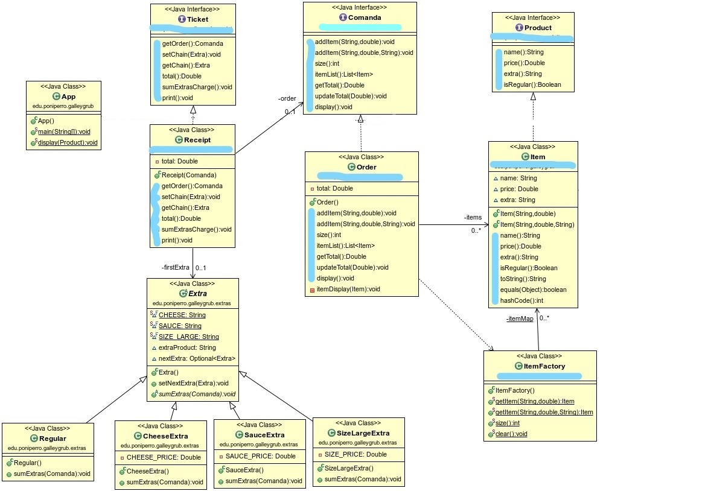

# Bikiny Galley Grub

Programing exercise in Java, proposed and created by [@Dfleta](https://github.com/dfleta).

### Introduction

Sponge Bob works as a cook in Krusty Krab, a famous restaurant for his hamburguer named "Krabby Patty"

The orders are taken by hand by Squidward Tentacles.

The owner, Eugene H. Krabs instead of buying a TPV, has decided to contract a Dual student in order to build a software to calculate the total import of the order and print the receipt.

Try to act programing if you don't want to end in the kitchen helping Bob to cook Krusty Burguers.

Implement the user's history with the logic written in the main class App.java.

### Class Diagram

Here's the diagram class, it contains two design patterns:

- Flyweight
- Chain responsability

